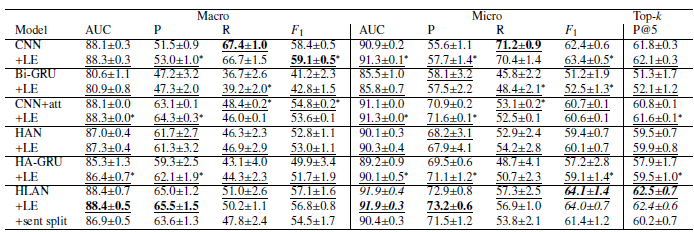
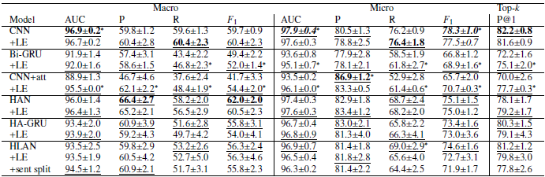
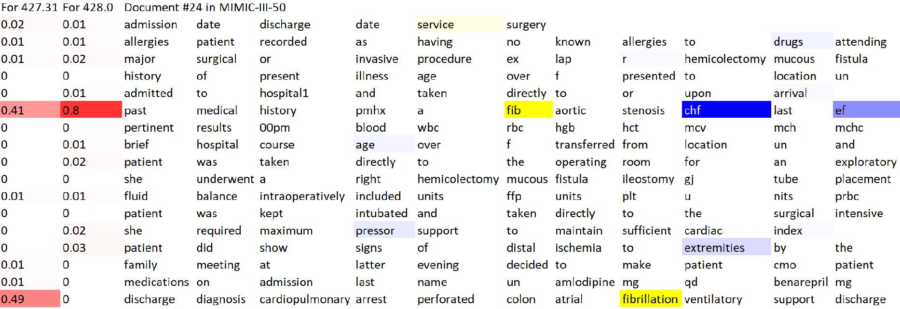

# [Citation to the original paper ](https://github.com/acadTags/Explainable-Automated-Medical-Coding)

# [Link to the original paper’s repo (if applicable)](https://doi.org/10.48550/arXiv.2010.15728)

# [Dependencies](https://github.com/cotcat/Reproducibility_Project_for_DL4H/blob/master/requirements.txt)

# Data download instruction:

1. Download all files from this GitHub repo

2. [`downloaded from onedrive (3.5G with other files)`](https://onedrive.live.com/?authkey=%21ACZVuCnEV2zDKow&id=22F95C44F607EC5B%21255141&cid=22F95C44F607EC5B)

3. Merge all the files downloaded with the GitHub repo files with the same name.

4. Follow original author's instruction to generate the preprocessing  [`datasets`](https://github.com/acadTags/Explainable-Automated-Medical-Coding/tree/master/datasets)

# Evaluation code + command (if applicable):

With dataset generated, then you can run [`plot-label-figure.ipynb`](https://github.com/cotcat/Reproducibility_Project_for_DL4H/blob/master/datasets/plot-label-figure.ipynb) and [`demo_HLAN_viz.ipynb`](https://github.com/cotcat/Reproducibility_Project_for_DL4H/blob/master/HLAN/demo_HLAN_viz.ipynb) to see the demo.

# Pretrained model (if applicable):

If you have [`downloaded from onedrive (3.5G with other files)`](https://onedrive.live.com/?authkey=%21ACZVuCnEV2zDKow&id=22F95C44F607EC5B%21255141&cid=22F95C44F607EC5B) and merge them with the repo file, you should have pretrained.

# Table of results (no need to include additional experiments, but main reproducibility result should be included):

Table 1: Results on MIMIC-III-50 dataset (50 la-
bels)(Dong, Su  ́arez-Paniagua, Whiteley and Wu, 2022)

Table 2: Results on MIMIC-III-shielding dataset (20 la-
bels)(Dong, Su  ́arez-Paniagua, Whiteley and Wu, 2022)

Figure 1: An example of colored visualisation from the
Hierarchical Label-wise Attention Network (HLAN).
The two red columns show the sentence-level attention
scores for the two codes respectively. The tokens high-
lighted by yellow (for code 427.31) or blue (for code
428.0) show the importance of them based on the value
of sentence-weighted word-level attention scores(Dong,
Su ́arez-Paniagua, Whiteley and Wu, 2022)

